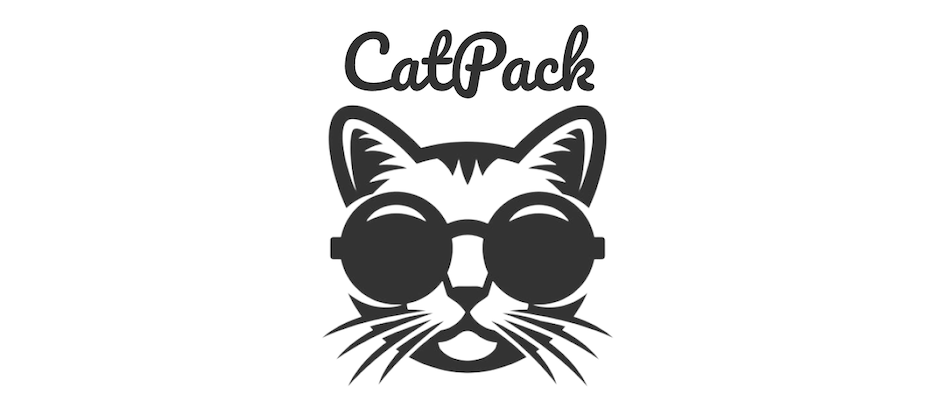

# Hello World! 🌎 I'm Geniece.🙋🏽‍♀️

## 👩🏾‍💻 About Me: 
Originally from Arkansas, I now call Dallas, TX my home. My fascination with technology started from a young age. As I grew, so did the digital world around me, and it wasn't long before I realized I wanted to be a part of the innovative community sculpting our digital landscape. My journey in the tech realm began with a deep curiosity: How do these digital tools that play such a pivotal role in our lives actually work? This simple question led me down the rabbit hole of software development.

Throughout my journey, I've had the privilege of collaborating with diverse teams on various projects. These experiences allowed me to not only hone my coding skills but also understand the intricacies of teamwork and the importance of effective workflows. Today, as an aspiring Software Developer, I am more passionate than ever about building robust, impactful software solutions and continuing my growth in this ever-evolving field.

 

## ❓Why I Chose Software Development: 
• **Creativity**: The digital realm offers boundless opportunities to innovate and design. From user interfaces to intricate algorithms, there's always room to create and reimagine. 
• **Problem Solving**: Every piece of code presents its unique set of challenges. I thrive on the continuous cycle of understanding, breaking down, and solving these puzzles. 
• **Impact & Contribution**: The code I write today has the potential to touch lives and transform industries tomorrow. The ripple effect of a software solution excites and motivates me daily. 

## 💯 Here's what motivates me:
  • **Dedication**: Every piece of code is a step towards mastering the art of programming.
 
  • **Growth Mindset**: Embracing challenges, eager to learn, and constantly seeking to improve.
 
  • **Collaborative Spirit**: Valuing team dynamics and understanding that when we unite our strengths, incredible things happen.
 

## 🌟 Projects Showcase

Here's a sneak peek of some projects that I'm particularly proud of. They represent my journey and growth as a developer.

### 1. 🎥🍿 FaveFlix 
#####  Movie App Project

- **Description**: Designed and developed a web-based movie database. Utilized RESTful API calls to enable CRUD (create, read, update, delete) functionality for dynamically rendered elements, including the use of modals to allow users to delete, add, and edit movies.
- **Tech Stack**: TMDb API, Pair Programming, jQuery, HTML, CSS, JavaScript
- **Project Contributor(s)**: Stephen Fredrickson
- **[View Live](https://faveflix-movie-app.netlify.app)** | **[View Code](https://github.com/tims-fredrickson-movie-application/movie-app)**

---

### 2. 🐈 CatPack
#####  Adlister Project        

- **Description**: A comprehensive platform tailored for feline aficionados. Users can browse, post, and manage ads for cat-related products, services, and sitters. Features include full CRUD capabilities for users and ads, a sophisticated search functionality based on ad titles, and a detailed view of ads with poster contact details. The user experience is elevated with a sleek navigation bar ensuring a seamless transition between pages.
- **Tech Stack**: HTML, CSS, Java, MySQL
- **Project Contributor(s)**: Johann Williams & Kofi Knowles
- **[View Live](URL_HERE)** | **[View Code](https://github.com/knowles-tims-williams-adlister/adlister)**

---

👉🏽 *Feel free to dive deep into these projects and share any feedback or questions you might have!*

## 🧰🛠️ Tools & Technologies I've Worked With:

## 🥅 My Goals:
1. **Master the Basics**: Before diving into specialized topics or advanced technologies, I aim to have a more solid understanding of foundational programming concepts and the primary languages I've worked with. 
2. **Build a Portfolio**: Design and develop a collection of personal projects that demonstrate my skills, creativity, and problem-solving abilities. 
3. **Improve Problem Solving**: Regularly practice coding challenges on platforms like LeetCode, HackerRank, or Codewars to sharpen my problem-solving skills. 
4. **Focus on Soft Skills**: Technical proficiency is essential, but so are soft skills. Work on effective communication, teamwork, time management, and adaptability. 
5. **Stay Updated**: Keep an eye on industry news, trends, and emerging technologies. This helps in staying relevant and identifying potential areas of interest or growth.

## 👩🏾‍🏫 Lessons Learned:
Throughout my journey into software development, I've encountered various challenges, each teaching me invaluable lessons. Here are a few that stand out:
 
1. **Iterative Development**: Starting small and iterating is the key. It's easier to manage, test, and refine. It's not about how fast you start but how well you finish. 
2. **Code Comments Matter**: I used to overlook commenting my code. Now, I realize that they are like breadcrumbs for anyone (including future me) who's trying to understand and potentially improve or debug the code. 
3. **The Power of Collaboration**: No one has all the answers. Teaming up with others has helped me look at problems from different perspectives and come up with more rounded solutions. 
4. **Embracing Failure**: Each failure is a stepping stone to success. Instead of getting discouraged, I've learned to analyze my mistakes, learn from them, and move forward with a better approach. 
5. **Continuous Learning**: Technology evolves rapidly. The importance of staying updated and continuously learning cannot be emphasized enough. This not just enhances skills but also instills a sense of confidence. 

*I believe these lessons, among many others, shape not just how I code but also how I approach challenges and work in teams. If you have any similar experiences or lessons to share, I'd love to hear them!*

## 📆 Upcoming Projects:
* Graduation Capstone: Aug. 17th - Sep. 8th 

## 📚 Recommended Reads: 
In my quest to constantly grow and evolve in the tech landscape, books have always been a source of knowledge and inspiration. If you're on a similar journey, here are a couple of recent additions to my bookshelf that I'd highly recommend:

• **Head First JavaScript Programming** - A brain-friendly guide that offers a comprehensive dive into the world of JavaScript, presenting the language in an engaging and interactive manner. 
• **Head First Java** - An essential read for any budding Java developer. It breaks down complex concepts with clear graphics and exercises, making the learning process both fun and effective.

👉🏽 *Feel free to share any book suggestions with me as well. Always looking to expand my library!*

## 🤝Let's Connect!
*I'd love to hear from you! You can drop me an email on Gmail or connect with me on LinkedIn. Excited about the possibility of connecting!*
 

